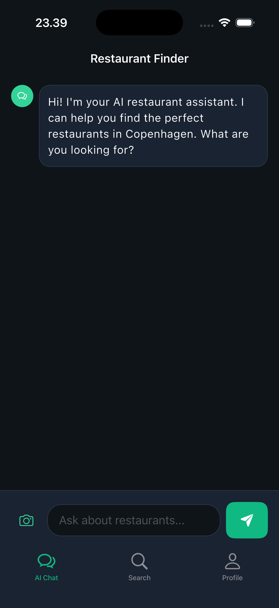
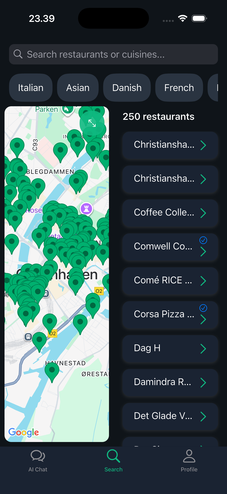
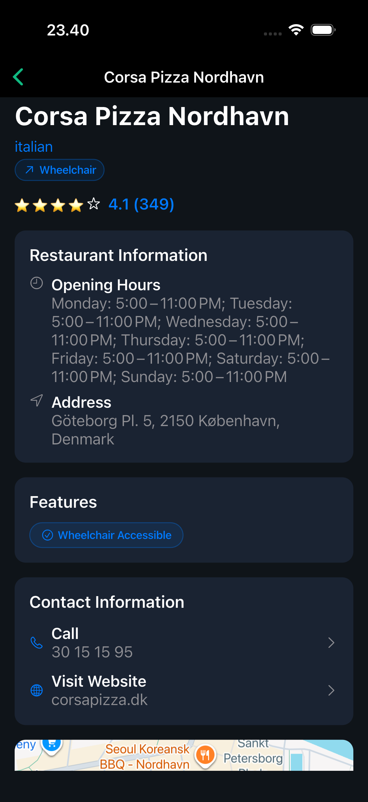

# Copenhagen Restaurant Finder

A Flutter mobile app to find restaurants in Copenhagen using AI-powered chat, machine learning-based food recognition, and geolocation.

## Features

- **AI Chat Interface** - Conversational restaurant recommendations via OpenRouter API
- **ML Food Recognition** - Take a photo of food -> Find restaurants that serve it 
- **Google Maps Integration** - View restaurants on map with your location
- **Biometric Authentication** - Face ID/Touch ID login

## Screenshots

  
  
   

## Tech Stack

- **Flutter** 
- **SQLite** 
- **TensorFlow Lite**
- **Google Maps**
- **Firebase**
- **OpenRouter API**

## Getting Started

1. Clone the repository
2. Install dependencies: `flutter pub get`
3. Create `.env` file with your API keys:
   - `GOOGLE_PLACES_API_KEY`
   - `GOOGLE_MAPS_API_KEY`
   - `OPENROUTER_API_KEY`
4. Run: `flutter run`
